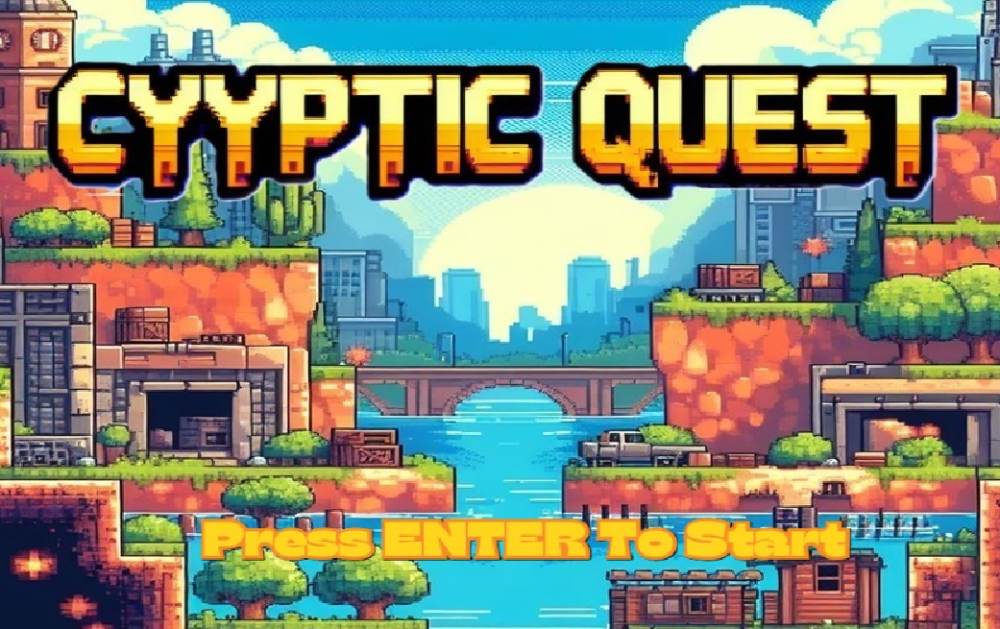
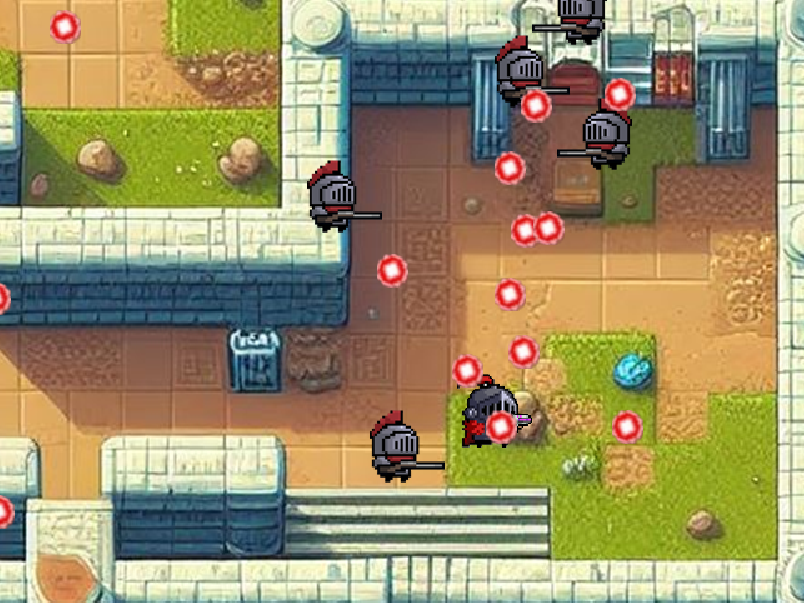

# Cyyptic Quest - 2D Single Player Game

##Objective of the game: Defeat all opponents

Lore: Long ago, in the mystical land of Eldoria, a powerful and malevolent sorcerer named Malgrim sought to conquer the entire realm. To achieve his dark ambitions, he delved into magic, summoning unspeakable creatures and twisting the very fabric of reality itself, splitting himself across 10 clones. As the hero, will you be able to outskill your opponent in a 1v10 in order to break this curse and free the realm? Only time will tell as the you embark on this perilous journey into the shroud of darkness.

Gameplay mechanics and/or user interaction: Use 'wasd' to move, left click/hold to shoot 

Scoring: N/A

Limitations:
Note that the walls collision do glitch sometimes. There is I-frame coded into the game, every time a player/enemy takes damage, they will be invincible for the second afterwards. 

Although the red squares display 3 health, each square actually represents 10 health each for a total of 30 health. Enemies have 3 heath and all projectiles deal 1 damage. 

Screenshots to provide further illustration and explanation of the program:

Press ENTER to start 

Try to survive while shooting the enemies 

Don't die and beat the game 

